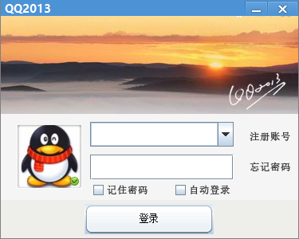

# vchat

## 介绍
大学写的一个聊天应用，初学java的同学可以看看

* 使用maven构建，原本是eclipse本地项目
* 使用java7的AIO通讯
* 界面模仿的是QQ2013，因为是2013-2014年写的
* ui使用的是swing接口
* 数据库使用mysql
* 后面再补充

## 使用

* 项目分为三个子项目:`base`、`client`、`server`
* mysql中新建数据库，导入项目的`chat.sql`到数据库中
* mvn install

## 待实现

* 使用`json`序列化代替`object serializable`
 

## 关于作者
